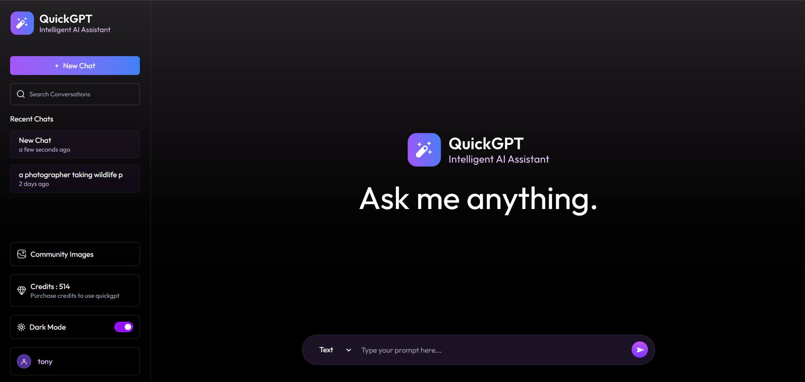

#  QuickGPT - AI Chat & Image Generation Platform

<p align="center">
  
</p>

QuickGPT is a full-stack **LLM-powered AI assistant** enabling real-time text, code,
and image generation using OpenAI and Gemini APIs. It features login/signup,
**credit-based payments via Stripe**, community image sharing, theme toggle, and
responsive design for both mobile and desktop.     

---

## 🚀 Features

- 🔐 User Authentication (JWT-based login/signup)  
- 💬 Real-time AI Chat using OpenAI API  
- 💻 Code Generation – write and copy instantly  
- 🖼️ Image Generation using Imagekit API  
- 🌆 Community Page to share & view AI-generated images  
- 💳 Stripe Payment Integration to buy credits  
- 🌓 Light & Dark Mode toggle  
- 📱 Fully Responsive UI (Mobile + Desktop)  
- 🚪 Logout & Session Management  

---

## 🛠️ Tech Stack

### 🧩 Frontend:
- React.js  
- Tailwind CSS + Bootstrap  
- Axios  
- React Router DOM  
- Toast Notifications  

### ⚙️ Backend:
- Node.js  
- Express.js  
- MongoDB + Mongoose  
- JSON Web Token (JWT)  
- Stripe API  
- dotenv  

### 🧠 AI Integration:
- OpenAI API (Text + Image models)

---

## ⚙️ Project Structure

QuickGPT/
│
├── client/                  # React Frontend  
│   ├── src/  
│   │   ├── assets/  
│   │   ├── components/  
│   │   ├── context/  
│   │   ├── pages/  
│   │   ├── App.jsx  
│   │   ├── main.jsx  
│   │   └── index.css  
│   ├── package.json  
│   └── vite.config.js  
│
├── server/                  # Node.js Backend  
│   ├── config/  
│   │   ├── db.js  
│   │   └── openai.js  
│   ├── controllers/  
│   │   ├── chatController.js  
│   │   ├── creditController.js  
│   │   ├── messageController.js  
│   │   ├── userController.js  
│   │   └── webhookController.js  
│   ├── middlewares/  
│   │   └── auth.js  
│   ├── models/  
│   │   ├── User.js  
│   │   ├── Chat.js  
│   │   └── Transaction.js  
│   ├── routes/  
│   │   ├── chatRoutes.js  
│   │   ├── userRoutes.js  
│   │   ├── messageRoutes.js  
│   │   ├── creditRoutes.js  
│   │   └── webhookRoutes.js  
│   ├── utils/  
│   │   └── secretToken.js  
│   ├── server.js  
│   └── package.json  
│
├── .env                     # Environment Variables  
├── README.md  
└── package.json  

---

## 📦 Installation

### 1️⃣ Clone the repository
```bash
git clone https://github.com/your-username/QuickGPT.git
cd QuickGPT

2️⃣ Setup Backend
cd server
npm install

3️⃣ Setup Frontend
cd server
npm install

💳 Stripe Payment & Credits System
- Stripe Checkout integrated for buying credits securely.
- Backend webhook updates: 
- User’s isPaid: true field
- Adds credits to user’s account
- Webhook endpoint: /api/webhooks

🌐 Deployment 
🚀 Frontend (Render)
⚙️ Backend (Render)

🧪 Sample Login
You can use mock credentials or register a new account.

Email: demo@example.com
Password: demo123
